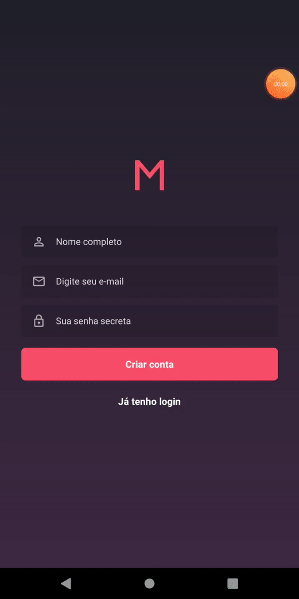

# The Mobile

This is the mobile part of the application, it is only meant for users that will attend the meetups. Users can view, subscribe, unsubscribe  to meetups and edit their profile. **Android only (for now)**

## How to run?

Oh boy.

First, run `yarn` or `npm install` to install everything this pretty boy needs to run.

Second, change, if necessary, the `baseURL` for the api on the `src/services/api.js` file to match your backend. Note that using `localhost` will cause the images to not render on Android, so use your actual Ip address there.

After everything is done, just run `react-native run-android` to install the app and run it with the metro bundler.

Connecting to reactotron can sometimes be a little tricky when it comes to Android or even more so on my case (physical device), on the `src/config/ReactotronConfig.js` file, change the host to your local Ip address and pray to any God of your choosing to get it to connect. You may need to refresh the app or even run it again.

## Navigation

Simple navigation within the app. There are 3 pages after you log in. Meetups, this will show all available meetups by date that you select. Subscriptions, lists every meetup that you have subscribed to. And profile, shows user info and allows to change your credentials.
 

Account Creation and Log in:

Meetups and subscriptions Navigation:

#### Known issues

When you have more than one subscription, deleting one will significally break the layout, not sure where the problem is. It kinda nullifies the styling of the component, it fixes itself on re-render.

#### Finally

Hopefully you were able to run everything up until here, I salute you and thank you so much for taking a little bit of your time to check my work here. I'm really happy with how this project turned out and I think it's a really good one for a first full stack project.

Native is awesome!
