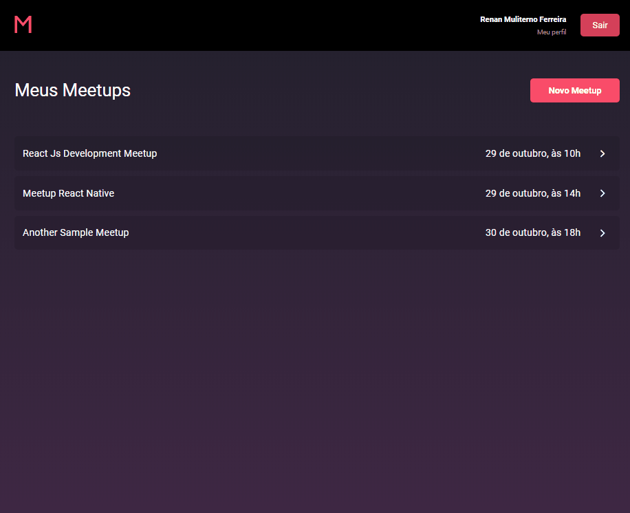

# The Web

This is the web-based part of the application, it is only meant for providers/organizers of meetups. Users can view, register, edit and delete meetups.

## How to run?

First install all the dependencies with `yarn` or `npm install`, next you only need to alter the api route inside `src/services/api`, by default, it is set to `http://localhost:3434`.

After this small setup, just run `yarn start` and the app should be running normally.

## Pages

You'll be greeted by a log in page, there's an option to register so try that first.

After logging you'll be in the dashboard. I'll leave some demos of the app here for those that do not wish to set up everything to see it working. (I'm so sorry for the gif's quality but it's the best I can do for now)
 

### Meetup Creation:

 

### Profile Update:

 

#### Known issues

As nothing is perfect in this life, there are some issues with this app.  
The layout may break depending on some very specific viewports, currently working on fixing this. 
The profile update may not work sometimes, I'm still not sure whether this an issue on redux or on the server since everything is passing perfectly, I'll look into it when there's more time available.  
The biggest of them all, the edit meetup screen won't load the meetup's banner and/or date. Forcing you to upload these informations all over again every time you try to alter something, huge no-no and will be fixed soon.

#### Finally

I hope you were able to run this, I put a lot of time and effort into learning everything in display here and to be able to do this when I did not knew what Javascript was not even one year ago really motivates me to keep going on this journey.

Have a joyous day and just keep coding!
